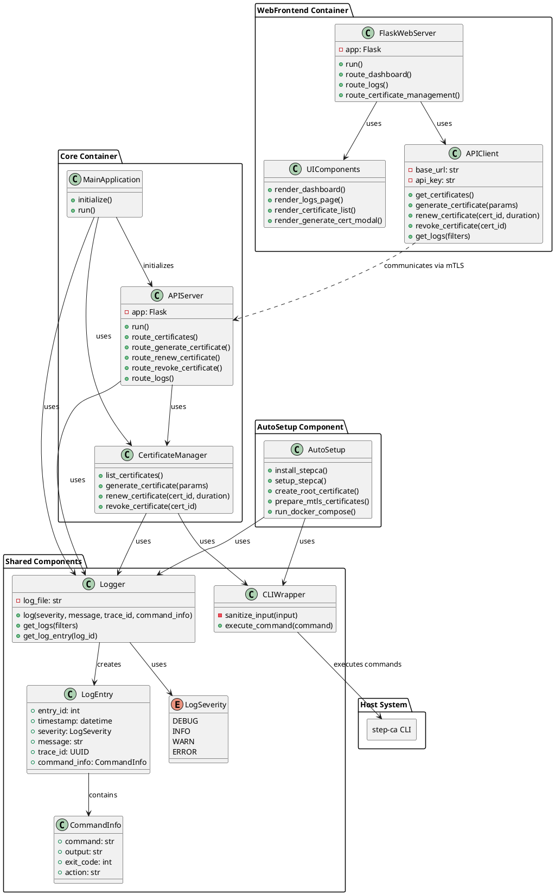

# About
The project is a web-based interface for managing a smallstep `step-ca` Certificate Authority.
In other words, it's shell wrapper for `step-ca` CLI.
It provides a user-friendly way to handle certificate operations, view logs, and manage server access.
The system is designed with security in mind, separating components with different privileges and logging all actions
for audit purposes. Written in python.

### Main Functions

#### Certificate Management
All on one page
- List certificates
- Generate new certificates (with options for key type, duration, etc.)
- Revoke certificates
- Renew certificates

#### Logging and Monitoring
- Every action such as certificate generation, revocation etc shows it's related logs immediately to user in the UI
- Every action shows shell command that it will execute
- Retrieve logs with filtering

#### Web UI
- Dashboard + Certificate Management Page
- Logs and Command History Page

#### Auto Setup
1. Install & setup `step-ca` on host
2. Create initial root certificate
3. Prepare certificates for mTLS
4. Run docker-compose.uml

### Security Features
- Separation of privileged sudo setup process from main application
- Main application runs in container with limited permissions, only `step-ca` on host is available
- Web UI is in separate basic docker container
- Input value restrictions (eg letters and numbers only for key name)
- Input sanitization in CLIWrapper to prevent command injection
- Use of subprocess module with shell=True for secure command execution
- Logging of all command executions for audit purposes
- Configuration loaded from a separate file
- Use of AppArmor/SELinux profiles for main container
- mTLS for secure communication between web frontend and main app
- Authentication via auth proxy
- Web Firewall
- Internal API keys via secret management
- Security events email alerts
- Read-only filesystem for containers

### Tech Stack
- Python
- Flask
- Docker
- Caddy (reverse proxy)
- Authelia (auth proxy)
- Bunkerweb (web firewall)
- step-ca CLI

### Additional Notes
- Type hints/dataclasses are used throughout for better code clarity and error checking
- The design allows for easy extension and maintenance
- The AutoSetup component (for initial installation and setup) is designed to be run separately with elevated privileges
- Web app auth is provided via third-party proxy, not required for this project

---
# Architecture

### Overview


### UI Mockup
Main page:
```
+--------------------------------------------+
|  Logo    [Dashboard]    [Logs]    [Menu]   |
+--------------------------------------------+
|                                            |
|  Certificate Management                    |
|  +--------------------------------------+  |
|  | List of Certificates                 |  |
|  | +--------------------------------+   |  |
|  | | Cert Name | Status  | Actions  |   |  |
|  | |-----------|---------|----------|   |  |
|  | | Cert 1    | Active  | [Renew]  |   |  |
|  | |           |         | [Revoke] |   |  |
|  | |-----------|---------|----------|   |  |
|  | | Cert 2    | Expired | [Delete] |   |  |
|  | +--------------------------------+   |  |
|  |                                      |  |
|  |     [Generate New Certificate]       |  |
|  +--------------------------------------+  |
+--------------------------------------------+
```

Generate cert modal dialog:
```
+------------------------------------------+
|  Generate New certificate                |
|  +------------------------------------+  |
|  | Key Name: __                       |  |
|  | Key Type: >RSA                     |  | #dropdown: RSA etc
|  | Duration: ___ >days                |  | #dropdown: minutes, hours etc
|  |                                    |  |
|  | Command that will be executed:     |  |
|  | [Click here to reload preview]     |  |
|  | [Execute!]                         |  | # if preview is loaded and all fields are filled
|  | <$ step-ca command ...          >  |  |
|  |                                    |  |
|  | Logs:            <In progress...>  |  |
|  | <Action-specific logs appear here> |  |
|  +------------------------------------+  |
+------------------------------------------+
```

Logs page:
```
+-----------------------------------------------------------------+
|  Logo    [Dashboard]    [Logs]    [Menu]                        |
+-----------------------------------------------------------------+
|                                                                 |
|  Logs and Command History                                       |
|  +-----------------------------------------------------------+  |
|  | Filters:                                                  |  |
|  | Severity: [All v]  Type: [All v]                          |  |
|  | Date Range: [From] [To]  [Apply]                          |  |
|  |                                                           |  |
|  | Search: [____________] [Search]                           |  |
|  |                                                           |  |
|  | +-------------------------------------------------------+ |  |
|  | | EntryID | Timestamp | Severity | TraceID | Message    | |  |
|  | |---------|-----------|----------|---------|------------| |  |
|  | | 00002   | 2023-08-1 | INFO     | abc123  | Generating | |  |
|  | |         | 7 10:15   |          |         | new cert   | |  |
|  | |         | $ step ca certificate ...                   | |  |
|  | |         | [Click to see command output...]            | |  |
|  | |---------|---------------------------------------------| |  |
|  | | 00003   | 2023-08-1 | WARN     | def456  | Cert not   | |  |
|  | |         | 7 10:14   |          |         | exists     | |  |
|  | |---------|--------------------------------|------------| |  |
|  | | 00004   | 2023-08-1 | DEBUG    | def456  | Request    | |  |
|  | |         | 7 10:13   |          |         | revoke     | |  |
|  | |---------|--------------------------------|------------| |  |
|  | | 00005   | 2023-08-1 | ERROR    | ghi789  | Permission | |  |
|  | |         | 7 10:12   |          |         | denied     | |  |
|  | +-------------------------------------------------------+ |  |
|  |                                                           |  |
|  | [Load More]                                               |  |
|  +-----------------------------------------------------------+  |
+-----------------------------------------------------------------+
```

### Logging

Log entry structure:
```python
class LogSeverity(Enum):
    DEBUG = "DEBUG"
    INFO = "INFO"
    WARN = "WARN"
    ERROR = "ERROR"


@dataclass
class CommandInfo:
    command: str
    output: str
    exit_code: int
    action: str


@dataclass
class LogEntry:
    entry_id: int
    timestamp: datetime
    severity: LogSeverity
    message: str
    trace_id: UUID
    command_info: CommandInfo | None # for entries with command execution
```

- Logs are stored in file (in future can be stored in database)
- Escaping for JSON serialization
- Log rotation and cleanup support
- Custom logger class for logging
- Special API endpoint for fetching logs, with filtering and pagination
- Scoped logging (trace_id) implemented for tracking actions across multiple log entries

### Core API

```yaml
openapi: 3.0.0
info:
  title: Step-CA Management API
  version: 0.0.1
  description: API for managing step-ca Certificate Authority

servers:
  - url: https://api.example.com/v1

paths:
  /certificates:
    get:
      summary: List all certificates
      parameters:
        - name: preview
          in: query
          schema:
            type: boolean
      responses:
        '200':
          description: Successful response
          content:
            application/json:
              schema:
                oneOf:
                  - type: array
                    items:
                      $ref: '#/components/schemas/Certificate'
                  - $ref: '#/components/schemas/CommandPreview'

  /certificates/generate:
    post:
      summary: Generate certificate
      parameters:
        - name: preview
          in: query
          schema:
            type: boolean
      requestBody:
        required: true
        content:
          application/json:
            schema:
              $ref: '#/components/schemas/CertificateGenerateRequest'
      responses:
        '200':
          description: Command preview or generation result
          content:
            application/json:
              schema:
                oneOf:
                  - $ref: '#/components/schemas/CertificateGenerateResult'
                  - $ref: '#/components/schemas/CommandPreview'

  /certificates/renew:
    post:
      summary: Preview renew certificate command
      parameters:
        - name: certId
          in: query
          required: true
          schema:
            type: string
        - name: duration
          in: query
          required: true
          schema:
            type: integer
            description: "Duration in seconds"
        - name: preview
          in: query
          schema:
            type: boolean
      responses:
        '200':
          description: Command preview
          content:
            application/json:
              schema:
                oneOf:
                  - $ref: '#/components/schemas/CertificateRenewResult'
                  - $ref: '#/components/schemas/CommandPreview'

  /certificates/revoke:
    post:
      summary: Preview revoke certificate command
      parameters:
        - name: certId
          in: query
          required: true
          schema:
            type: string
        - name: preview
          in: query
          schema:
            type: boolean
      responses:
        '200':
          description: Command preview
          content:
            application/json:
              schema:
                oneOf:
                  - $ref: '#/components/schemas/CertificateRevokeResult'
                  - $ref: '#/components/schemas/CommandPreview'

  /logs/single:
    get:
      summary: Get log entry by ID
      parameters:
        - name: logId
          in: query
          required: true
          schema:
            type: string
      responses:
        '200':
          description: Successful response
          content:
            application/json:
              schema:
                $ref: '#/components/schemas/LogEntry'


  /logs:
    get:
      summary: Retrieve logs
      parameters:
        - name: severity
          in: query
          schema:
            type: array
            items:
              type: string
              enum: [ DEBUG, INFO, WARN, ERROR ]
        - name: traceId
          in: query
          schema:
            type: string
            description: "UUID format"
        - name: commandsOnly
          in: query
          schema:
            type: boolean
        - name: page
          in: query
          schema:
            type: integer
        - name: pageSize
          in: query
          schema:
            type: integer
      responses:
        '200':
          description: Successful response
          content:
            application/json:
              schema:
                type: array
                items:
                  $ref: '#/components/schemas/LogEntry'

components:
  schemas:
    Certificate:
      type: object
      properties:
        id:
          type: string
        name:
          type: string
        status:
          type: string
          enum: [ Active, Expired, Revoked ]
        expirationDate:
          type: string
          format: date-time

    CertificateGenerateRequest:
      type: object
      properties:
        keyName:
          type: string
        keyType:
          type: string
          enum: [ RSA, ECDSA ]
        duration:
          type: string

    CommandPreview:
      type: object
      properties:
        command:
          type: string

    CertificateGenerateResult:
      type: object
      properties:
        success:
          type: boolean
        message:
          type: string
        logEntryId:
          type: string
        certificateId:
          type: string
        certificateName:
          type: string
        expirationDate:
          type: string
          format: date-time

    CertificateRenewResult:
      type: object
      properties:
        success:
          type: boolean
        message:
          type: string
        logEntryId:
          type: string
        certificateId:
          type: string
        newExpirationDate:
          type: string
          format: date-time

    CertificateRevokeResult:
      type: object
      properties:
        success:
          type: boolean
        message:
          type: string
        logEntryId:
          type: string
        certificateId:
          type: string
        revocationDate:
          type: string
          format: date-time

    LogEntry:
      type: object
      properties:
        entry_id:
          type: integer
        timestamp:
          type: string
          format: date-time
        severity:
          type: string
          enum: [ DEBUG, INFO, WARN, ERROR ]
        message:
          type: string
        traceId:
          type: string
          description: "UUID format"
        commandInfo:
          $ref: '#/components/schemas/CommandInfo'
          nullable: true
          description: Contains command execution info, if entry is related to command

    CommandInfo:
      type: object
      properties:
        command:
          type: string
        output:
          type: string
        exitCode:
          type: integer
```

### Class Diagram  


### File structure
```
project_root/
│
├── docker-compose.yml
├── README.md
│
├── shared/
│   ├── __init__.py
│   ├── cli_wrapper.py
│   ├── logger.py
│   └── models.py
│
├── web_frontend/
│   ├── Dockerfile
│   ├── requirements.txt
│   ├── app.py
│   ├── api_client.py
│   ├── ui_components.py
│   └── templates/
│       ├── base.html
│       ├── dashboard.html
│       ├── logs.html
│       ├── certificate_management.html
│       └── modals/
│           └── generate_cert.html
│
├── core/
│   ├── Dockerfile
│   ├── requirements.txt
│   ├── main.py
│   ├── api_server.py
│   └── certificate_manager.py
│
├── auto_setup/
│   ├── auto_setup.py
│   └── requirements.txt
│
└── config/
    ├── app_config.yml
    └── logging_config.yml
```


---

# TODO
- [ ] Adjust class diagram after finalizing the project